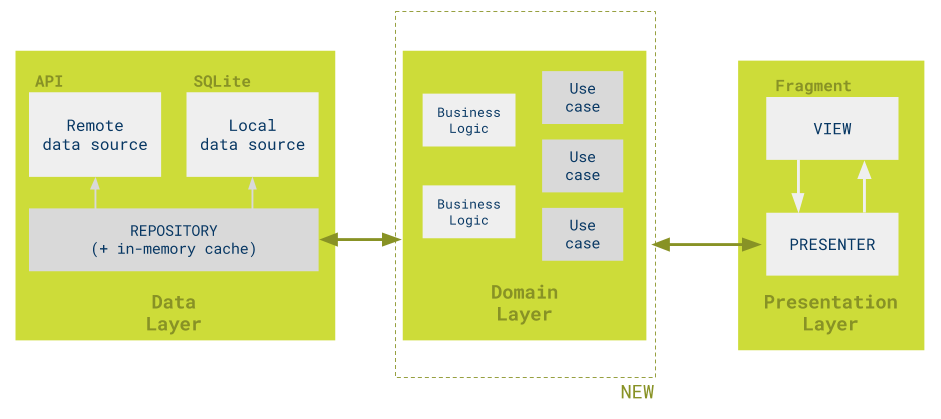

# IT 팀 빌딩 서비스 FE(서비스 이름 미정)

## 실행 방법

node 16

```bash
npm install
-- husky 설치
npm run prepare
-- 실행 (http://localhost:5173)
npm run dev
-- story book 실행 (http://localhost:6006)
npm run storybook
```

## 아키텍처



클린 아키텍처를 기반으로 하는 구글 샘플 프로젝트의 구조를 참조합니다.

https://github.com/android/architecture-samples/tree/todo-mvp-clean
