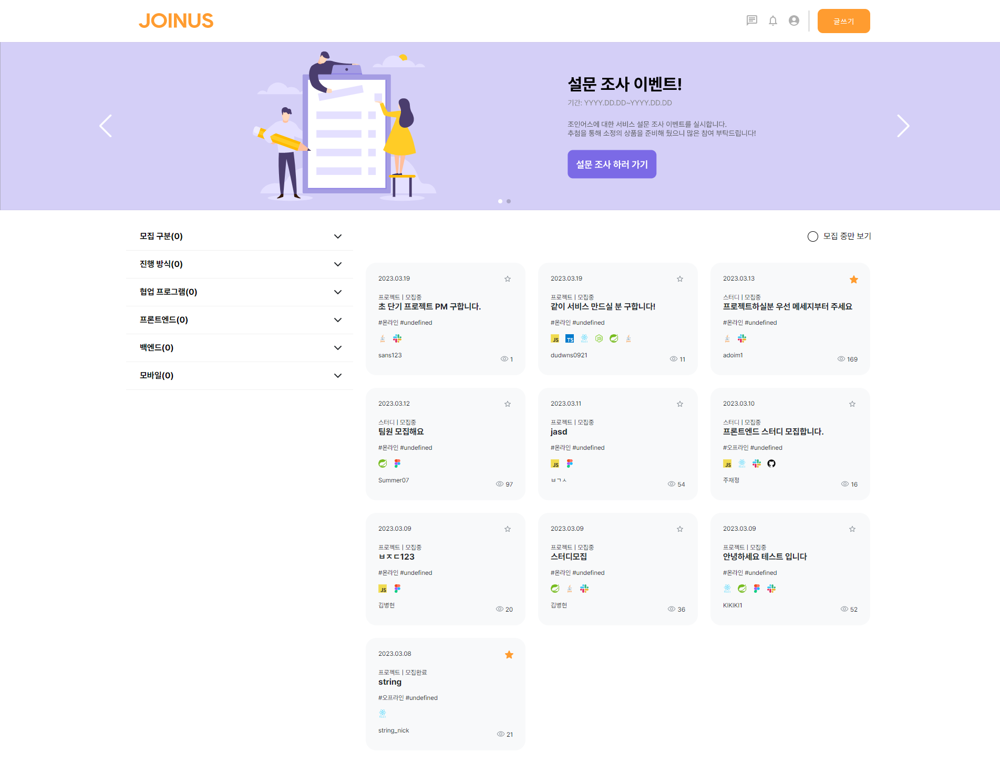

# [Joinus] 개발을 위한 인력 매칭 서비스

## 시연영상

🎬 [시연 영상 보러가기](https://youtu.be/lchUEy-PWBQ)

## ✨ 기술스택

#### FRONT-END

         

## 핵심 기능

### 🔍 공고 검색 & 작성

> * 모집구분, 진행방식, 협업 프로그램, 지원 분야에 따른 공고 작성
> * 모집구분, 진행방식, 협업 프로그램, 지원 분야에 따른 공고 정렬 및 필터링 

### 👠 공고 지원

> * 지원 현황을 통해 이 공고의 경쟁률을 확인 할 수 있음
> * 마음에 드는 공고를 찾을시, 특정 분야에 지원 가능 

### 🔔 채팅

> * 채팅을 통해 공고 작성자와의 채팅 기능

### 🔔 지원 알림

> * 본인 글에 새로운 지원자가 생길 경우 알람 기능
> * 지원한 사람의 간단한 정보를 알림에서 즉각적으로 확인 가능

### 🧑🏻 마이페이지

> * 내가 한 북마크, 작성 공고, 지원한 공고를 한 눈에 확인 가능
> * 프로필 수정을 통해 다양한 정보를 기입할 수 있음

## 트러블슈팅

웹 소켓 연결 엔드포인트를 찾지 못하는 이슈

- 문제상황  
  채팅 기능을 구현하기 위해 웹소켓 관련 라이브러리 설치 이후 서버와 연결을 시도 할때
  웹소켓이 서버를 찾지 못하고 연결되지 않는 현상을 마주침. 해당 문제가 해결되지 않아
  채팅기능 개발이 일주일동안 늦춰지고 있었음.

- 해결 과정
  
  - sockjs-client / stompjs 라이브러리를 재설치. 문제가 해결되지 않음.
  - 연결 로직을 복사하여 그대로 새로운 리액트 프로젝트 생성하여 적용. 서버 연결 성공.
    현재 개발중인 프로젝트는 vite + react 이었으므로 vite 설정의 문제라고 판단.
  - 새로운 vite + react 프로젝트를 생성하여 같은 코드를 통해 연결을 시도 하던중 순수한 리액트 프로젝트에선 발생하지 않는 오류가 발생하는것을 발견함.
  - 몇몇 라이브러리는 vite 에서 global 객체를 찾지 못하는 현상이 있음을 확인함. 이번 케이스의 경우 웹 소켓 으로 채팅을 구현하기 위하여 받은 라이브러리가 해당 오류를 일으킴.
  - 해당 오류를 해결하기 위하여 [stack overflow 검색 결과](#https://stackoverflow.com/questions/72114775/vite-global-is-not-defined)를 적용하여 vite 설정에 global 객체를 빈 객체 리터럴로 설정 해두었던 것이 해당 라이브러리 오류는 피해갔지만 동시에 백엔드 서버를 찾지 못하는 원인이 되었던 것.
  - index.html 스크립트에 global = window 를 추가하여 해결.

- 결과   
  서버와의 연결이 성공하는것을 확인 하고 난 후에 바로 기능개발에 착수하여 채팅 기능을 3일만에 완성 할 수 있었음.

- 정리 
  
  - vite 는 webpack 처럼 global필드를 정의하지 않습니다. 일부 라이브러리는 오래 되어 global에 의존하는 코드를 가지고 있습니다. 
    
    - 일반적인 경우 window.global ||= window; 등의 코드 추가를 고려해볼만 합니다 
    - 프로젝트에서 사용된 sockjs 의 경우 글로벌객체를 참조하는 코드를 가지고 있습니다 [ex) if (global.document) { transportList = require(‘./transport-list’)]   
  
  - 이로 인해 global을 정의하지않는 vite환경에서 global 객체를 찾을수 없다는 오류를 발생시켰고, 이를 해결하기 위해서 적용한 global = {} 코드가 global 을 빈 객체로 만들어 예상치 못한 동작을 일으킵니다.    
  
  - websocket 은 브라우저에서 작동 하므로 해당 global 에 대한 참조를 브라우저 전역 객체인 window 로 바꾸어주어 해결합니다.
    
    

    

## 프로젝트 관리

지속적인 배포(CD)

* 지속적인 배포의 필요성
  * 기능이 추가될 때마다 배포해야하는 불편함이 있어 배포 자동화의 필요성 인식
* AWS Amplify를 사용해 master 브랜치의 변경으로 자동으로 감지하고 빌드 및 배포를 진행하도록 설정

Git

 

* Git Commit 메시지 컨벤션의 필요성
  
  * commit된 코드가 어떤 내용을 작성 했는 지 파악하려면 commit을 확인해야 한다.
  * 프로젝트 진행 중에는 수 많은 코드가 commit되기 때문에 일일이 내용을 확인하기 힘들기 때문에 
    메시지 컨벤션을 통해서 제목이나 description을 통해서 commit의 정보를 전달한다.
  * 널리 쓰이는 Udacity Commit Message Convention을 따른다.
  
  

  

## 팀원

| 이름  | 포지션      | 분담                                      | @ Email                   | Github                           |
| --- | -------- | --------------------------------------- | ------------------------- | -------------------------------- |
| 정영준 | FrontEnd | 공고 crud                             | dudwns0921@gmail.com      | https://github.com/dudwns0921    |
| 박경서 | FrontEnd | 전체 서포트 웹소켓 실시간 채팅 구현 알림 기능 구현 | troublesome.dev@gmail.com | https://github.com/kyungseo-park |
| 이예담 | FrontEnd | 회원가입 로그인(소셜로그인) 마이페이지 개인정보 수정   | dldpeka0909@gmail.com     | https://github.com/leeyedam      |
| 이상돈 | FrontEnd | 웹소켓 실시간 채팅 구현 알림 기능 구현             | hateyou@kakao.com         | https://github.com/powercording  |

## 🌈 대표사진

## 😺 멤버

| [🔰정영준](https://github.com/dudwns0921)                                                                         | [박경서](https://github.com/kyungseo-park)                                                                        | [이예담](https://github.com/leeyedam)                                                                             | [이상돈](https://github.com/powercording)                                                                         |
|:--------------------------------------------------------------------------------------------------------------:|:--------------------------------------------------------------------------------------------------------------:|:--------------------------------------------------------------------------------------------------------------:|:--------------------------------------------------------------------------------------------------------------:|
|  |  |  |  |
| FRONT-END                                                                                                      | FRONT-END                                                                                                      | FRONT-END                                                                                                      | FRONT-END                                                                                                      |
